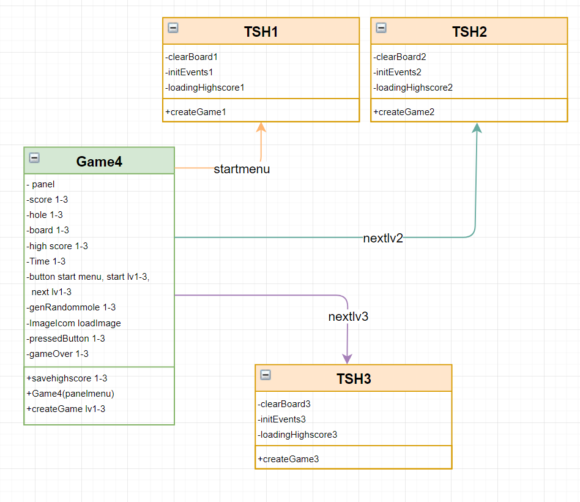

# 🐹 Whack-a-Mole Game

**Whack-a-Mole Game** is a desktop game developed using **Java** and **NetBeans IDE**.

The game is inspired by the classic Whack-a-Mole concept, where players need to hit moles that appear within the game area to earn points.

This project was created as a programming exercise to practice **Java programming, Object-Oriented Programming (OOP), GUI development, and event handling**.

---

## 🎮 Game Overview

The objective of the game is simple: **hit as many moles as possible**.

### How to Play

1. Start the game.
2. A mole appears within the game area.
3. Click the mole to hit it.
4. Successfully hitting a mole increases the score.
5. Try to achieve the highest score possible.

---

## ✨ Features

* 🐹 Whack-a-Mole gameplay
* 🖱️ Mouse interaction
* 🏆 Score tracking
* 🎮 Simple and easy-to-understand gameplay
* 🖥️ Desktop application
* 🧩 Object-Oriented Programming structure
* 🎨 Graphical User Interface (GUI)

---

## 🛠️ Technologies

| Technology      | Purpose                      |
| --------------- | ---------------------------- |
| ☕ Java          | Main programming language    |
| 🟦 NetBeans IDE | Development environment      |
| 🖥️ Java GUI    | Graphical user interface     |
| 🧩 OOP          | Program structure and design |

---

## 📂 Project Structure

```text
Whack-a-mole-game/
│
├── Whack_a_mloe_game/
│   └── Source Code
│
├── Whack_a_mloe_clssdiagram.PNG
│   └── Class Diagram
│
└── README.md
```

---

## 🧩 Class Diagram

The project includes a **Class Diagram** to illustrate the structure and relationships between the classes used in the game.



---

## 🚀 Getting Started

### Requirements

Before running the project, make sure you have:

* Java JDK
* NetBeans IDE

### Installation

Clone the repository:

```bash
git clone https://github.com/panupongsdn-rgb/Whack-a-mole-game.git
```

Open the project using **NetBeans IDE**:

```text
File → Open Project
```

Select the project folder, then:

```text
Build Project → Run Project
```

---

## 🎯 Project Objectives

This project was developed to practice:

* Java programming
* Object-Oriented Programming (OOP)
* Desktop application development
* GUI development
* Event handling
* Game logic
* Score management
* Class design and relationships

---

## 📚 Learning Outcomes

Through this project, I gained practical experience in developing a Java desktop application and applying Object-Oriented Programming concepts.

The project also helped me understand how to handle user interactions, implement game logic, design classes, and create a graphical user interface.

---

## 📌 Project Information

**Project:** Whack-a-Mole Game
**Language:** Java
**IDE:** NetBeans
**Type:** Desktop Application

**Repository:**
https://github.com/panupongsdn-rgb/Whack-a-mole-game

---

## 👨‍💻 Author

**Panupong Singdee**

GitHub:
https://github.com/panupongsdn-rgb

---

## 📄 License

This project was created for educational and portfolio purposes.
